<!-- ishtihoss/ishtihoss · GitHub profile README -->
<!-- Aesthetic: matte gunmetal, restrained emerald, industrial sci-fi. -->

Independent product engineer building and operating AI-native software end to end.

  

---

## About

I'm a solo founder and engineer based in Vancouver. I handle the full product surface: product decisions, interface design, backend systems, infrastructure, releases, and support.

My current work centers on AI-native developer tools and focused software for people doing real work. I also contribute upstream to **[MLX](https://github.com/ml-explore/mlx)**, Apple's machine-learning framework for Apple silicon.

## Products

| Product | Focus | What it does |
|:--|:--|:--|
| **[porkicoder](https://porkicoder.com)** | Agentic coding assistant | Reads code, edits files, runs commands, and coordinates parallel sub-agents. A collaborator, not another autocomplete. |
| **[resumehog](https://resumehog.com)** | Resume optimization | Tailors a resume to a specific role by matching what hiring teams actually screen for. |
| **[hogmatix](https://hogmatix.com)** | X automation | Schedules posts and operates multiple X accounts from one place. |

## Open source

Patches sent upstream to MLX. The count below is live from the GitHub API.

## Technical range

| Product & interface | Backend & data | Systems & infrastructure |
|:--|:--|:--|
| TypeScript, JavaScript, React, Next.js | Python, Node.js, FastAPI, PostgreSQL | MLX, AWS, Cloudflare, Linux, Git |

## GitHub activity

<!-- Generated twice daily by .github/workflows/profile-graphics.yml. -->

---

Building from Vancouver · design, code, infrastructure, support.

