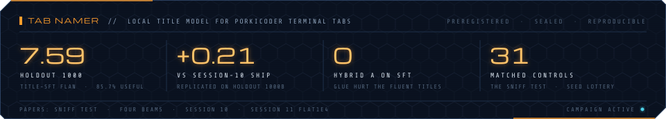
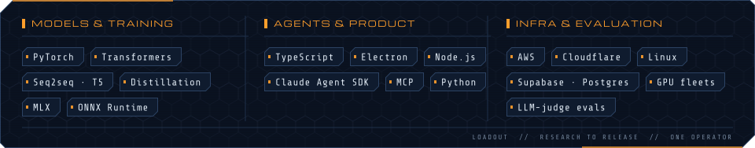

<!-- ishtihoss/ishtihoss · GitHub profile README -->
<!-- Aesthetic: deep-space holo UI. Amber + cyan on navy, chamfered panels, dossier framing. -->
<!-- Static graphics: `npm run build` → tools/build-assets.mjs → assets/*.svg -->
<!-- Live telemetry: .github/workflows/profile-graphics.yml → tools/fetch-telemetry.mjs + tools/build-telemetry.mjs → `output` branch -->

  

I'm an AI engineer and ML researcher in Vancouver. I train small models and ship the products around them — as one person, end to end: research question, training runs, evaluation, product design, backend, infrastructure, releases, and support.

Current focus: sub-100M-parameter models that run locally inside my own products, held to preregistered, blinded evaluation against strong baselines. I also contribute upstream to **[MLX](https://github.com/ml-explore/mlx)**, Apple's machine-learning framework for Apple silicon.

**Tab Namer** is a 35M-parameter local model that names [PorkiCoder](https://porkicoder.com) terminal tabs from a bounded task description — trained from scratch, distilled from frontier teachers, and shipped on-device. The write-ups, published with reproducible payloads and SHA-256 manifests:

| Paper | Finding |
|:--|:--|
| **[Four beams, no new weights](https://porkicoder.com/research/tab-namer-four-beams.html)** | Same 35M checkpoint, beam-4 over visible page-word pairs. Beat the title-tuned FLAN-T5-small (77M) stack on the preregistered sealed 1,000: 6.20 vs 5.45, paired +0.752 (95% CI 0.61–0.89) — while honestly reporting that the conjunctive usefulness gate did not clear. |
| **[Mid-pack GSG](https://porkicoder.com/research/tab-namer-mid-gsg.html)** | A new 35M trained from scratch on 4.86M body→title pairs catches the previous locked stack and ties raw FLAN on a blinded four-way packet, at half FLAN's size. |
| **[The Sniff Test](https://porkicoder.com/research/the-sniff-test.html)** | A 12.7M model *seemed* to stop repeating words after reading Jules Verne. 31 matched control runs showed it was a seed lottery, not a mechanism — one run is not evidence. |

Each of these is designed, built, deployed, and supported solo — models, product, backend, billing, releases.

| Operation | Class | Brief |
|:--|:--|:--|
| **[porkicoder](https://porkicoder.com)** | Agentic coding assistant | Desktop agent that reads code, edits files, runs commands, and coordinates parallel sub-agents. Ships local models (Tab Namer) on-device. |
| **[resumehog](https://resumehog.com)** | Resume optimization | Tailors a resume to a specific role by matching what hiring teams actually screen for. |
| **[hogmatix](https://hogmatix.com)** | X automation | Schedules posts and operates multiple X accounts from one place. |

Patches sent upstream to MLX. The count below is live from the GitHub API.

<!-- Regenerated twice daily by .github/workflows/profile-graphics.yml from the GitHub GraphQL API. -->

